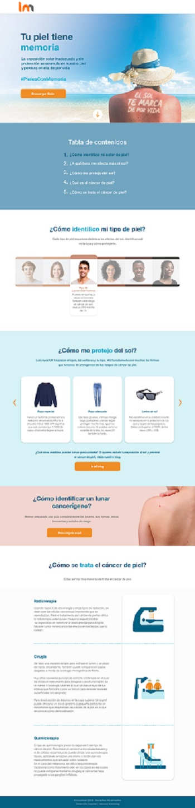

# **Caso Impulse**

</img>

##  **OBJETIVO**

Crear una landing page para información acerca de protección de la piel.

## **Diseño**

.

##  Tecnologias Usadas
- Jquery
- Html5
- Css

## Autor

- **Claudia Garibotto** - [@claudiagari](https://github.com/claudiagari)

## Licencia

Este proyecto está licenciado bajo la Licencia ISC - ver el archivo [LICENSE](https://www.isc.org) para más detalles.

Copyright &copy; 2018 All Rights Reserved.